# 🏛️ CutSlot — Elite Atelier & Digital Salon Orchestrator

[](./LICENSE)

---

## 1. Project Overview

**CutSlot** is a full-stack, premium digital platform for luxury salon management. It connects Guests, Artisans (Workers), and Administrators, providing a seamless experience for booking, service management, and business oversight. The system is designed for high performance, security, and elegant user experience.

---

## 2. Features

- Role-based access: Guest, Worker, Admin
- Modern, glassmorphic UI with light/dark mode
- Secure authentication (JWT, Bcrypt)
- Real-time booking and queue management
- Service (ritual) catalog and reviews
- Wallet and transaction tracking
- Multi-floor dispatch logic (no worker overlap)
- Admin dashboards for analytics, audits, and workforce management
- Responsive design for all devices

---

## 3. System Architecture

CutSlot uses a decoupled MVC architecture for scalability and maintainability.

**System Flow:**

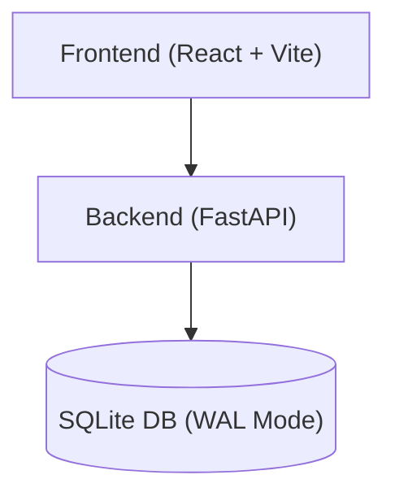

- **Frontend:** React (Vite), role-based routing, state/context management
- **Backend:** FastAPI, SQLAlchemy ORM, JWT authentication
- **Database:** SQLite (WAL mode)

---

## 4. Screenshots / Visual Gallery

Explore the platform's premium UI and role-based modules below. All images are from the live system and grouped by user role for clarity.

### 🏠 Landing & Authentication
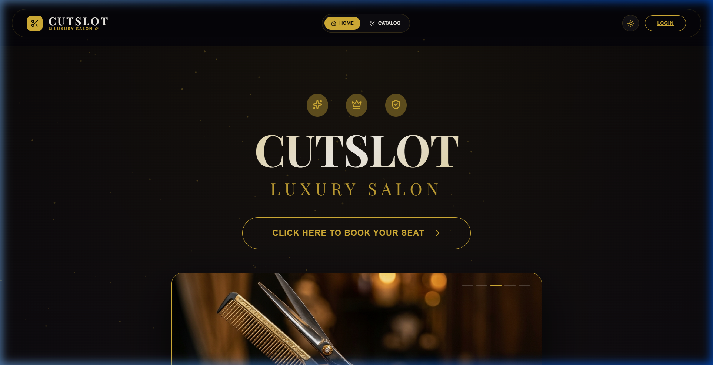
*Landing experience*

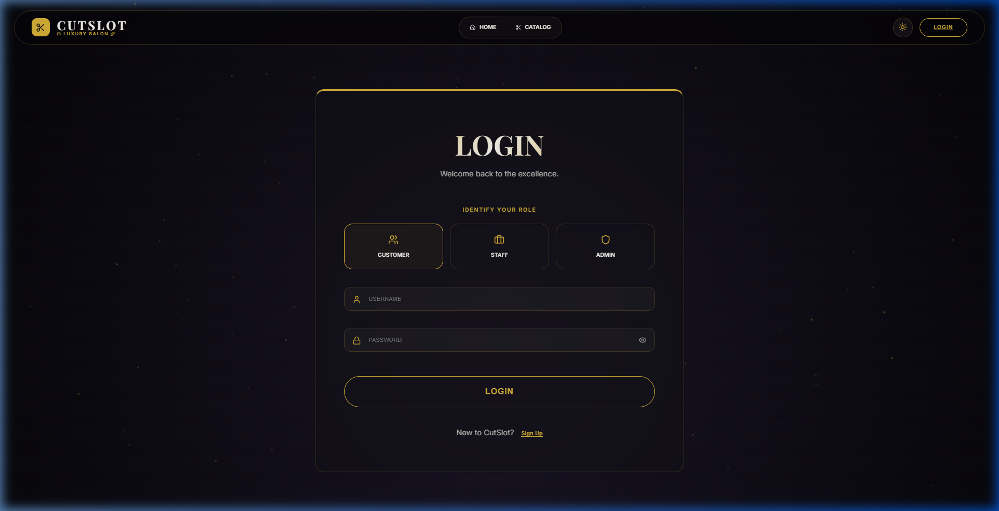
*Login & registration portal*

### 👤 Client Experience
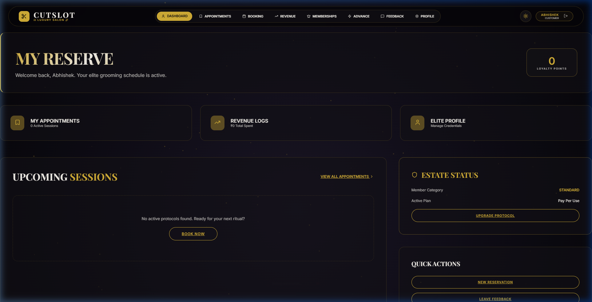
*Client dashboard overview*

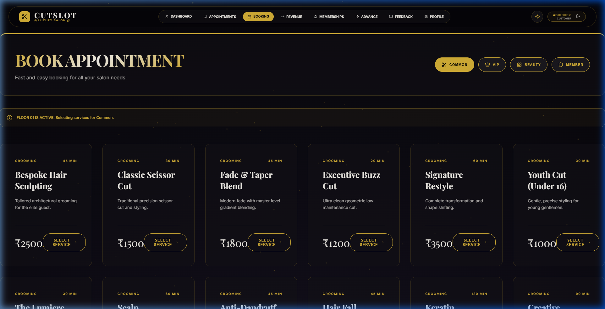
*Service booking flow*

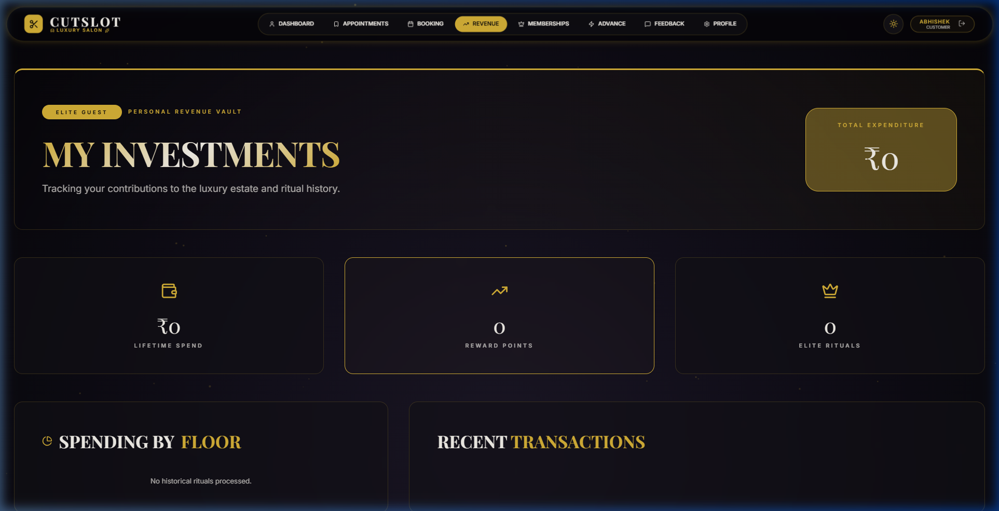
*Wallet and transactions*

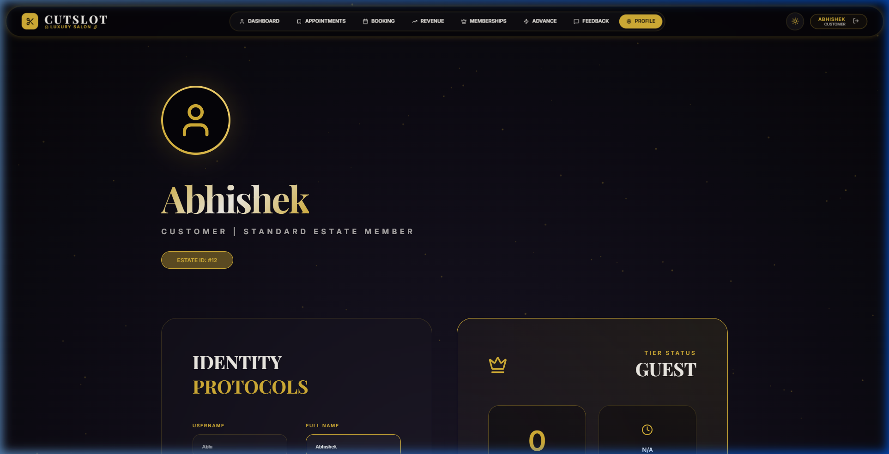
*Profile management*

### ✂️ Worker Experience
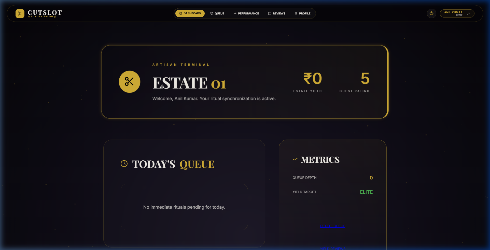
*Worker dashboard & queue*

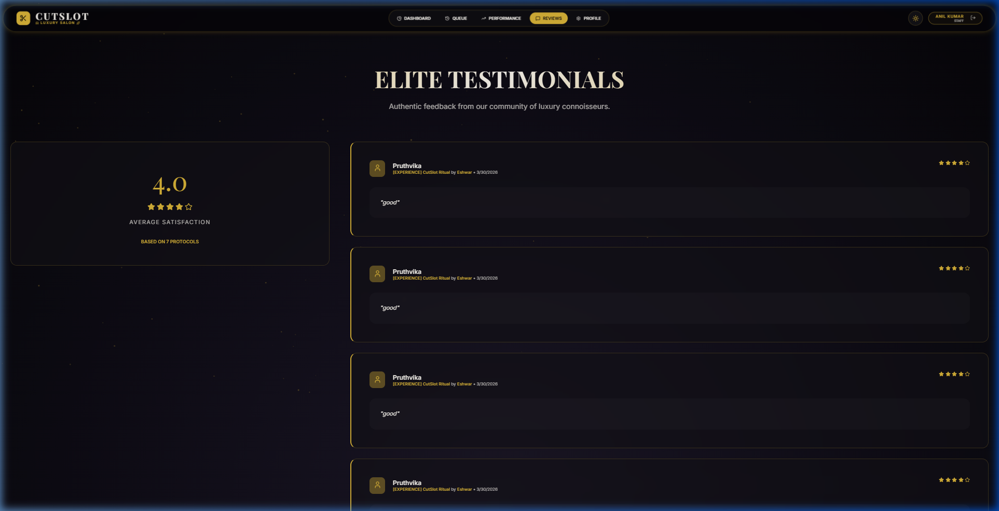
*Performance feedback & reviews*

### 👑 Admin Experience
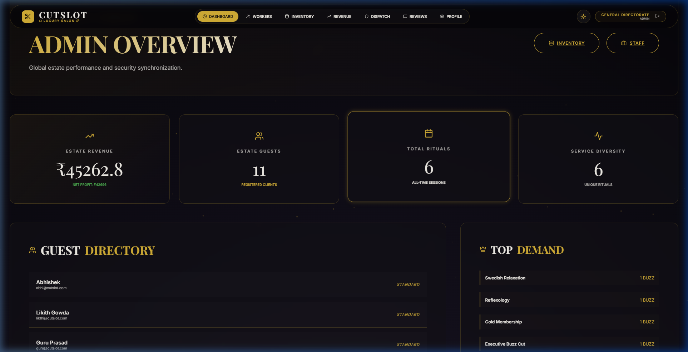
*Admin dashboard & analytics*

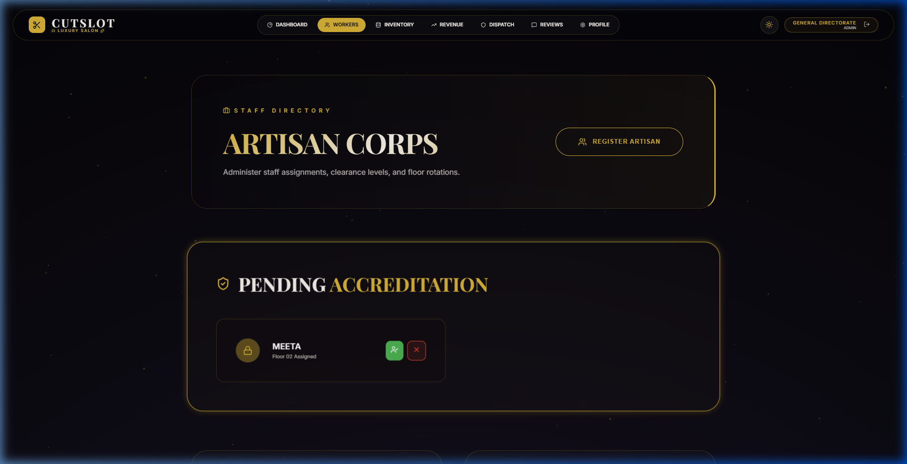
*Workforce management*

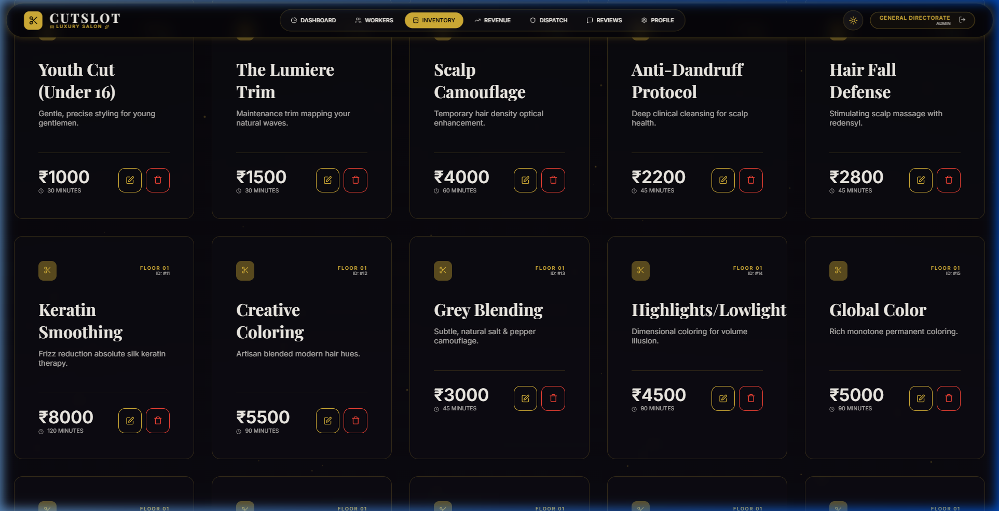
*Service catalog administration*

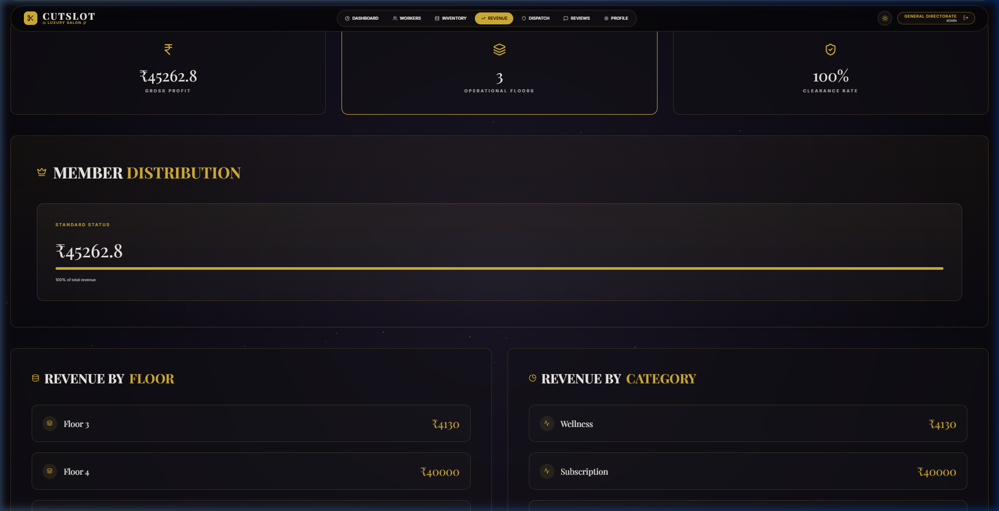
*Revenue analytics*

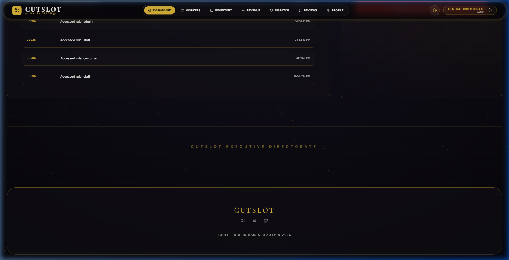
*Audit trail & compliance*

### ⭐ Common Modules
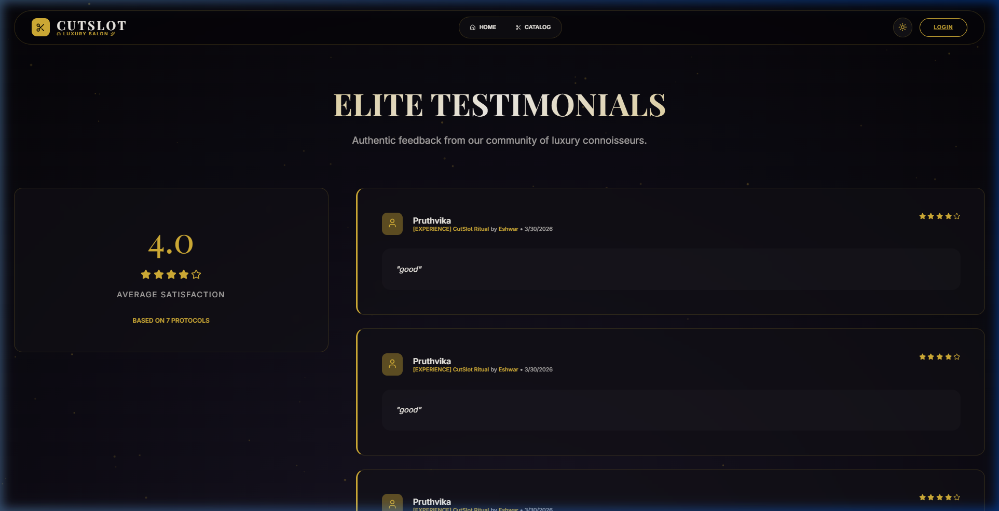
*Service reviews*

---

## 5. Project Structure

```
Cutslot-2/
├── backend/         # FastAPI backend (Python)
│   ├── main.py      # API entrypoint
│   ├── models.py    # SQLAlchemy models
│   ├── schemas.py   # Pydantic schemas
│   ├── auth.py      # Auth logic (JWT, Bcrypt)
│   ├── database.py  # DB config
│   └── ...
├── frontend/        # React + Vite frontend
│   ├── src/
│   │   ├── pages/   # Role-based pages (admin, worker, client, common)
│   │   ├── components/
│   │   └── ...
│   └── ...
├── Screenshots/     # UI screenshots
├── README.md
├── LICENSE
└── ...
```

---

## 6. Installation Guide

### Prerequisites
- Node.js >= 18.x & npm >= 9.x
- Python >= 3.10

### 1. Clone the Repository
```bash
git clone https://github.com/sunilt808/Cutslot-2.git
cd Cutslot-2
```

### 2. Backend Setup
```bash
cd backend
python -m venv .venv
# Activate virtual environment (Windows)
.venv\Scripts\activate
pip install -r requirements.txt
# (Optional) Initialize DB with seed data
python main.py --reset-db --seed-all
# Start FastAPI server
uvicorn main:app --port 8000 --reload
```

### 3. Frontend Setup
```bash
cd ../frontend
npm install
npm run dev
```

- Frontend: http://localhost:5173
- Backend API: http://localhost:8000

---

## 7. Environment Variables

### Backend (.env example)
Create a `.env` file in `backend/` (or set directly in `auth.py`/config):
```
SECRET_KEY=your-production-secret-key
DATABASE_URL=sqlite:///./cutslot.db
ACCESS_TOKEN_EXPIRE_MINUTES=30
```

### Frontend (.env example)
Create a `.env` in `frontend/` if you need to override API URLs:
```
VITE_API_URL=http://localhost:8000
```

---

## 8. API Documentation

- **Swagger UI:** [http://localhost:8000/docs](http://localhost:8000/docs)
- **ReDoc:** [http://localhost:8000/redoc](http://localhost:8000/redoc)
- Endpoints defined in `backend/main.py` and submodules

---

## 9. Tech Stack

| Layer      | Technology                        |
|------------|-----------------------------------|
| Frontend   | React 19, Vite, React-Router-Dom 7, Lucide Icons |
| Styling    | Custom CSS (Glassmorphism, Theme-Aware) |
| Backend    | FastAPI (Python 3.10+)            |
| Database   | SQLite + SQLAlchemy (WAL Mode)    |
| Auth       | JWT, Bcrypt                       |

---

## License

This project is licensed under the [MIT License](./LICENSE).

---

*Developed & Maintained by Sunil*

