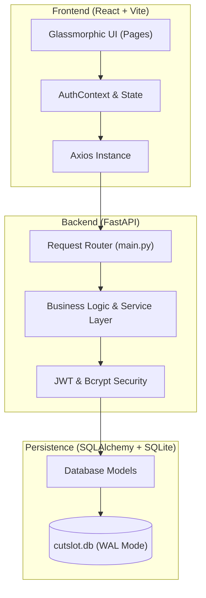

# 🏛️ CUTSLOT — Elite Atelier & Digital Salon Orchestrator

**CutSlot** is a premium, full-stack digital ecosystem engineered for high-end luxury salon management. It seamlessly bridges the gap between **Elite Clients**, **Skilled Artisans**, and the **General Directorate (Administrators)** through a glassmorphic, high-performance interface.

---

## 🖼️ Estate Visual Gallery

### 🏠 The Grand Entrance

*The premium landing experience — first impressions of the CutSlot estate.*


*Secure portal for Guests, Artisans, and Directorate members.*

### 👤 Guest Experience

*A personalized vista for ritual history, wallet tracking, and bookings.*


*The ritual booking flow — selecting services, artisans, and time slots.*


*Financial overview with wallet balance, transactions, and top-up options.*


*Profile management and personalization settings.*

### ✂️ Artisan Dispatch

*The professional queue for managing floor operations and client rituals.*


*Artisan performance feedback and client ratings.*

### 👑 The Directorate Command

*Real-time business intelligence and financial oversight.*


*Workforce management — onboarding, scheduling, and performance tracking.*


*Service catalog administration across all ritual categories.*


*Revenue analytics and financial reporting dashboard.*


*Audit trail for security, compliance, and operational transparency.*

### ⭐ Common Modules

*Verified ritual feedback — contextual reviews tied to specific services and artisans.*

---

## 🏗️ System Architecture & Logic

The CutSlot platform follows a strict **Decoupled MVC (Model-View-Controller)** architecture to ensure scalability and role-based security.

### **📐 Architectural Flow**



### **MVC Mapping**
*   **MODEL (Data Layer):** Defined in `backend/models.py` using SQLAlchemy. Managed via Pydantic schemas in `backend/schemas.py`.
*   **VIEW (Interaction Layer):** A React-based ecosystem in `frontend/src/pages`. Divided by roles: `admin/`, `worker/`, `client/`, and `common/`.
*   **CONTROLLER (Logic Layer):** Orchestrated by FastAPI endpoints in `backend/main.py`. Handles routing, session validation, and state transitions.

---

## 🌓 Elite Feature Set

### **1. Dynamic Theme Versatility**
The Estate UI supports a global **Light/Dark Mode** switch. 
- **Glassmorphic Depth:** Custom variables like `--glass-tint` ensure that card readability and aesthetic luxury are preserved in every environment.
- **Premium Symbols:** Integration of `lucide-react` for a sharp, modern iconography feel.

### **2. Verified Ritual Feedback**
Our stabilized review system bridges the "Trust Gap":
- **Contextual Transparency:** Guests evaluate specific **Rituals** (e.g., Hair Cut, Skincare) performed by specific **Artisans**.
- **Inclusive Vetting:** Reviews are now open to all registered clients. A guest can only "Vette" an artisan after a ritual is officially "Completed" in the Dispatch queue.

### **3. Dispatch Intelligence**
A multi-floor operational model (Floors 01-04) that prevents artisan overlap and ensures guests are routed to their designated station efficiently.

---

## 🛠️ Technology Stack

| Layer | Technology |
| :--- | :--- |
| **Frontend** | React 19, Vite, React-Router-Dom 7, Lucide Icons |
| **Styling** | Custom Responsive CSS (Vibrance, Glassmorphism, Theme-Aware) |
| **Backend** | FastAPI, Python 3.10+ |
| **Database** | SQLite + SQLAlchemy (Write-Ahead-Logging Architecture) |
| **Security** | JWT-Bearer Tokens, Bcrypt Hashing, Role-Based Access Control |

---

## 🚀 Estate Initiation Guide

### 1. Database Prime
Synchronize the estate with 60+ seeded rituals and pre-vetted worker registries:
```bash
python main.py --reset-db --seed-all
```

### 2. Backend Ignition
```powershell
uvicorn main:app --port 8000 --reload
```

### 3. Frontend Ignition
```powershell
npm run dev
```

---
*Developed & Stabilized by Sunil*
